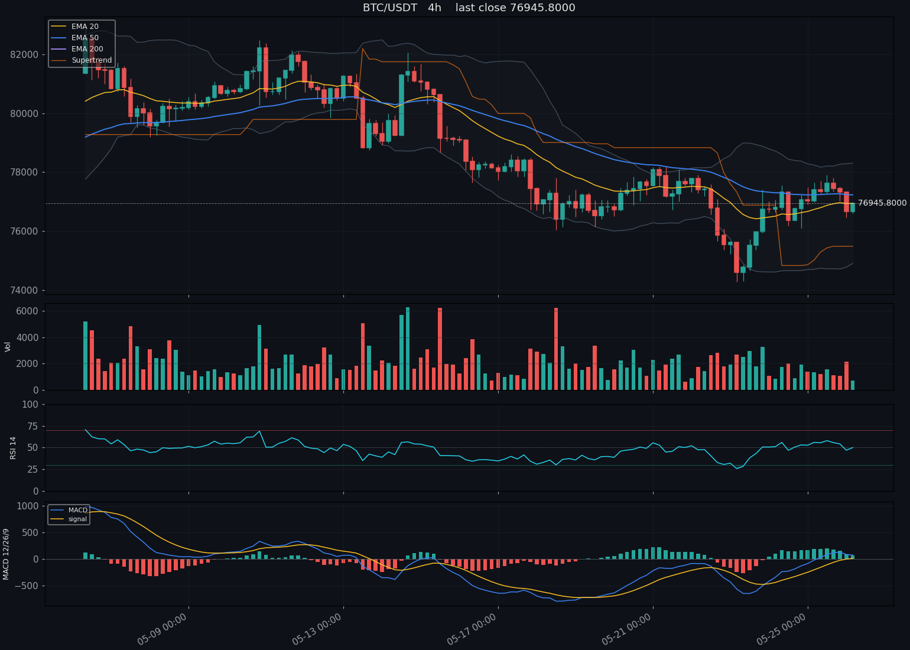

# Real run outputs

These Markdown files are the rendered output of `mimo-tradelens analyze` against
live exchange data, served through `mimo-v2.5` (vision) + `mimo-v2.5-pro`
(reasoning) on the Xiaomi MiMo Open Platform.

| file | symbol | timeframe | bias | conviction |
|---|---|---|---|---|
| `btc_4h_long.md` | BTC/USDT | 4h | LONG | 6.3 |
| `eth_4h_short.md` | ETH/USDT | 4h | SHORT | 5.7 |
| `sol_1h_no_trade.md` | SOL/USDT | 1h | NO_TRADE | 2.4 |

A rendered chart preview (the exact image the vision model receives) lives at
[`btc_4h_chart.png`](./btc_4h_chart.png).



The `NO_TRADE` example is intentionally included — a good signal engine must be
willing to say "no setup" when conditions are choppy. MiMo TradeLens treats
`NO_TRADE` as a first-class verdict, not a fallback.

## Reproducing

```bash
export MIMO_API_KEY=...
mimo-tradelens analyze BTC/USDT --tf 4h --output markdown > my_btc_4h.md
mimo-tradelens analyze ETH/USDT --tf 4h --output markdown > my_eth_4h.md
mimo-tradelens analyze SOL/USDT --tf 1h --output markdown > my_sol_1h.md
```

Outputs will differ from these snapshots because market conditions change in
real time — the **structure** of the response stays the same.
